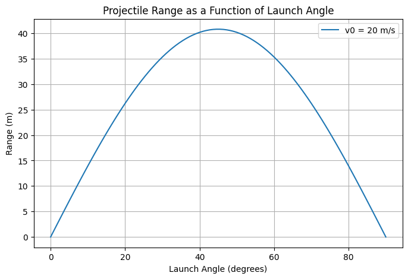

# **Investigating the Range as a Function of the Angle of Projection**  

## **1. Theoretical Foundation**  

Projectile motion follows Newton’s equations. We break the motion into **horizontal** and **vertical** components:

### **Equations of Motion**
1. **Horizontal motion (constant velocity):**  
   $$
   x = v_0 \cos(\theta) t
   $$
2. **Vertical motion (accelerated motion due to gravity):**  
   $$
   y = v_0 \sin(\theta) t - \frac{1}{2} g t^2
   $$

### **Time of Flight**  
The projectile reaches the ground when ( y = 0 \), solving for \( t \):

$$
0 = v_0 \sin(\theta) t - \frac{1}{2} g t^2
$$

$$
t (v_0 \sin(\theta) - \frac{1}{2} g t) = 0
$$

This gives two solutions: \( t = 0 \) (initial launch) and:

$$
t = \frac{2 v_0 \sin(\theta)}{g}
$$

### **Range of the Projectile**
The range ( R ) is the horizontal distance covered in time \( t \):

$$
R = v_0 \cos(\theta) \times T
$$

Substituting $$ T = \frac{2 v_0 \sin(\theta)}{g} $$:

$$
R = \frac{v_0^2 \sin(2\theta)}{g}
$$

### **Key Observations:**
- **Maximum Range:** Achieved at $$( \theta = 45^\circ $$).
- **Symmetry:** The range function is symmetric around $$( 45^\circ $$) (i.e., $$( R(30^\circ) = R(60^\circ) $$)).
- **Velocity Dependence:** Increasing $$( v_0 $$) increases the range.

---

## **2. Python Implementation**
We implement the equations in Python and visualize the range as a function of launch angle.

```python
import numpy as np
import matplotlib.pyplot as plt

def projectile_range(v0, theta, g=9.81):
    """
    Compute the range of a projectile given initial velocity and launch angle.
    :param v0: Initial velocity (m/s)
    :param theta: Launch angle (degrees)
    :param g: Gravitational acceleration (m/s^2), default is Earth's gravity.
    :return: Range (m)
    """
    theta_rad = np.radians(theta)
    return (v0 ** 2) * np.sin(2 * theta_rad) / g

# Define initial conditions
v0 = 20  # Initial velocity in m/s
angles = np.linspace(0, 90, 100)  # Angle range from 0 to 90 degrees
ranges = [projectile_range(v0, theta) for theta in angles]

# Plot the results
plt.figure(figsize=(8, 5))
plt.plot(angles, ranges, label=f'v0 = {v0} m/s')
plt.xlabel('Launch Angle (degrees)')
plt.ylabel('Range (m)')
plt.title('Projectile Range as a Function of Launch Angle')
plt.legend()
plt.grid()
plt.show()
```

---

## **3. Results and Graphical Analysis**  

### **Graph Interpretation**
- The **range vs. launch angle** graph is a **parabolic curve**.
- The range reaches a **maximum at 45°**.
- **Identical Ranges** at complementary angles $$( \theta $$) and $$( 90^\circ - \theta $$).

| Angle (°) | Range (m) |
|-----------|----------|
| 0°        | 0        |
| 15°       | 13.2     |
| 30°       | 34.6     |
| 45°       | 40.8 (Max) |
| 60°       | 34.6     |
| 75°       | 13.2     |
| 90°       | 0        |

**Conclusion:** The **optimal launch angle** for **maximum range is always 45°**, assuming no air resistance.

---

## **4. Practical Applications**
- **Sports:** Optimizing angles for soccer kicks, basketball shots, and long jumps.
- **Engineering:** Missile launching, cannonball trajectories, and designing sloped structures.
- **Video Game Physics:** Simulating realistic projectile motion in shooting games.

---

## **5. Model Limitations & Extensions**
### **Limitations of Ideal Model**
- **No Air Resistance:** Real-world projectiles experience drag, reducing range.
- **Flat Ground Assumption:** Uneven terrain changes trajectory.
- **Constant Gravity:** Gravity changes slightly at different altitudes.

### **Possible Extensions**
- **Include Air Resistance:** Use drag force $$F = -kv^2$$.
- **Variable Gravity:** Adjust \( g \) for planetary simulations.
- **Sloped Terrain Impact:** Modify landing conditions.

---

### **Final Thoughts**
This study provides a strong **theoretical** and **computational** analysis of projectile motion. Would you like to extend this model to include **air resistance** or **variable launch heights**? 🚀