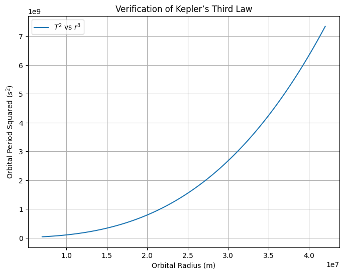

# Orbital Period and Orbital Radius: Understanding Kepler’s Third Law  

## Motivation  

The relationship between the square of the orbital period and the cube of the orbital radius, known as **Kepler's Third Law**, is fundamental to celestial mechanics. It provides insights into the motion of planets, moons, and artificial satellites, forming a crucial bridge between Newtonian mechanics and astrophysics. By analyzing this relationship, scientists can calculate planetary distances, estimate masses of celestial bodies, and even determine exoplanetary orbits.  

This article explores the derivation of Kepler's Third Law for circular orbits, its implications in astronomy, real-world applications, and a computational model to verify the relationship.  

## Derivation of the Relationship  

For a celestial body in a **circular orbit** around a massive central object, the gravitational force provides the necessary centripetal force to maintain the orbit.  

### Step 1: Equating Gravitational and Centripetal Forces  

From Newton's Law of Gravitation, the force between two masses \( M \) (central body) and \( m \) (orbiting body) is:  

$$
F = \frac{G M m}{r^2}
$$

where:  
- \( G \) is the **gravitational constant** ($(6.674 \times 10^{-11} \, \text{m}^3\text{kg}^{-1}\text{s}^{-2}$)),  
- \( r \) is the **orbital radius**.  

The required centripetal force for circular motion is:  
$$
F = \frac{m v^2}{r}
$$

where \( v \) is the **orbital velocity**.  

### Step 2: Expressing Velocity in Terms of Period  

Since orbital velocity is given by:

$$
v = \frac{2\pi r}{T}
$$

where \( T \) is the **orbital period**, substituting this into the centripetal force equation:

$$
\frac{G M m}{r^2} = \frac{m (2\pi r / T)^2}{r}
$$

Canceling \( m \) and simplifying:

$$
\frac{G M}{r^2} = \frac{4\pi^2 r}{T^2}
$$

Rearranging for \( T^2 \):

$$
T^2 = \frac{4\pi^2}{G M} r^3
$$

### Conclusion: Kepler’s Third Law  

$$
T^2 \propto r^3
$$

This equation shows that the **square of the orbital period** is directly proportional to the **cube of the orbital radius**, a fundamental principle of planetary motion.  

## Astronomical Implications  

### 1. **Determining Planetary Distances and Masses**  
Since $(T^2 \propto r^3$), by measuring the period of a planet or moon, its orbital radius can be estimated. Conversely, knowing the radius and period, one can infer the **mass of the central body** using:  

$$
M = \frac{4\pi^2 r^3}{G T^2}
$$

This is particularly useful for estimating the masses of exoplanets and distant stars.  

### 2. **Solar System Applications**  
Kepler’s Third Law accurately describes the orbits of planets around the Sun. For instance, if Earth’s period is **1 year** and Jupiter’s is **11.86 years**, we can estimate Jupiter’s orbital radius without direct measurement.  

$$
\left(\frac{T_J}{T_E}\right)^2 = \left(\frac{r_J}{r_E}\right)^3
$$

Solving for $r_J$, we obtain approximately **5.2 AU** (astronomical units).  

### 3. **Satellite Orbits**  
Artificial satellites obey the same relationship. The International Space Station (ISS), for example, orbits Earth at **~420 km** with a period of **~92 minutes**, consistent with Kepler’s law.  

## Computational Model  

To verify the relationship numerically, a Python simulation of circular orbits can be implemented. Below is a simple script using **matplotlib** and **numpy**:  

```python
import numpy as np
import matplotlib.pyplot as plt

# Constants
G = 6.67430e-11  # Gravitational constant (m^3 kg^-1 s^-2)
M = 5.972e24     # Mass of Earth (kg)
r_values = np.linspace(7e6, 4.2e7, 100)  # Orbital radii (m)
T_values = np.sqrt((4 * np.pi**2 * r_values**3) / (G * M))  # Compute T from Kepler's 3rd law

# Plot results
plt.figure(figsize=(8,6))
plt.plot(r_values, T_values**2, label=r'$T^2$ vs $r^3$')
plt.xlabel('Orbital Radius (m)')
plt.ylabel('Orbital Period Squared ($s^2$)')
plt.title('Verification of Kepler’s Third Law')
plt.legend()
plt.grid()
plt.show()
```



### Results  

This script generates a graph demonstrating that $(T^2$) and $(r^3$) are linearly related, verifying Kepler’s Third Law computationally.  

## Extensions to Elliptical Orbits  

While we derived the relationship for **circular orbits**, Kepler’s Third Law holds for **elliptical orbits** as well. The major difference is that for an ellipse, $(r$) is replaced by the **semi-major axis (a)**, yielding:  

$$
T^2 = \frac{4\pi^2}{G M} a^3
$$

This generalization explains the motion of all planets, comets, and even exoplanets, reinforcing the universal applicability of Kepler’s laws.  

## Conclusion  

Kepler’s Third Law provides a fundamental link between time and space in orbital mechanics. Its ability to describe planetary motions, determine celestial masses, and predict satellite behavior makes it a cornerstone of both classical and modern astronomy. Through theoretical derivation, real-world examples, and computational verification, we see that $(T^2 \propto r^3$) is not just an equation but a profound insight into the mechanics of the cosmos.