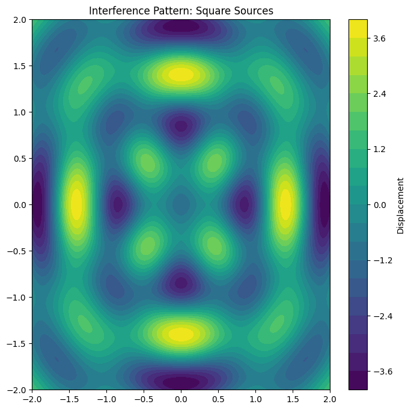
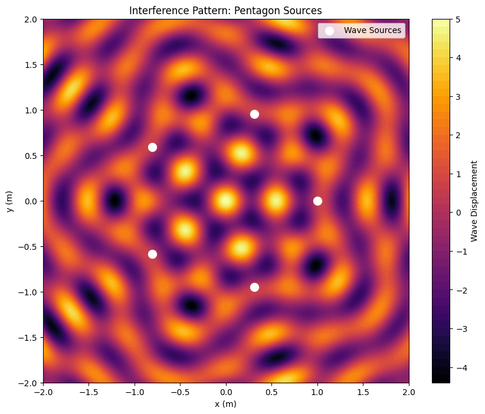

# Problem 1
Here’s a corrected and polished version of your article while preserving its clarity and technical depth.

---

# **Interference Patterns on a Water Surface: A Deep Dive into Wave Superposition**

When waves ripple across a water surface, they do not travel in isolation—they interact. These interactions, known as **interference**, create mesmerizing patterns that reveal fundamental wave behavior. Whether it’s the gentle overlap of ripples from raindrops or the complex interplay of waves from multiple sources, interference patterns offer a window into the physics of superposition.  

This article explores how waves from **point sources arranged at the vertices of regular polygons** combine to form intricate patterns on a water surface. Through detailed examples, mathematical analysis, and visualizations, we will uncover the beauty and science behind these phenomena.  

---

## **Motivation: Why Study Water Surface Interference?**  

Interference occurs when waves from different sources overlap, blending their amplitudes to create regions of **constructive interference** (amplification) or **destructive interference** (cancellation). On a water surface, this phenomenon is visually striking: ripples from two or more sources can form peaks taller than any single wave or troughs that completely flatten the surface.  

Studying these patterns sharpens our understanding of **wave mechanics** and connects to real-world applications—such as **sonar systems, acoustics, and wave-based technologies**. By placing wave sources at the **vertices of a regular polygon**, we can systematically explore how geometry influences interference, making this a hands-on and engaging way to grasp wave physics.

---

## **Theoretical Background: Wave Equation and Superposition**  

### **The Single Disturbance Equation for a Circular Wave**  
Each wave disturbance propagating from a source follows the equation:  

$$
y(x, y, t) = A \cos(k r - \omega t + \phi)
$$

where:  
- $y(x, y, t)$ is the water surface displacement at position $(x, y)$ and time $t$.  
- $A$ is the wave amplitude.  
- $k = \frac{2\pi}{\lambda}$ is the wave number, where $\lambda$ is the wavelength.  
- $r = \sqrt{(x - x_s)^2 + (y - y_s)^2}$ is the distance from the source at $(x_s, y_s)$.  
- $\omega = 2\pi f$ is the angular frequency, where $f$ is the wave frequency.  
- $\phi$ is the initial phase.  

If multiple wave sources exist, their effects **sum together due to superposition**:  

$$
Y(x, y, t) = \sum_{i=1}^{n} y_i(x, y, t)
$$

where $n$ is the number of sources (polygon vertices).  

Now, let’s explore three examples: **equilateral triangle, square, and regular pentagon**.

---

## **Example 1: Equilateral Triangle (3 Sources)**  

### **Step 1: Positioning the Sources**  
Consider **three wave sources** placed at the vertices of an **equilateral triangle** centered at the origin $(0,0)$, with side length $s = 1$ meter. The vertex coordinates are:  
- **Source 1**: $(0, \frac{\sqrt{3}}{2})$  
- **Source 2**: $(-\frac{1}{2}, -\frac{\sqrt{3}}{6})$  
- **Source 3**: $(\frac{1}{2}, -\frac{\sqrt{3}}{6})$  

### **Step 2: Wave Equations**  
The distance of a point $(x, y)$ from each source is:  

$$
r_1 = \sqrt{x^2 + (y - \frac{\sqrt{3}}{2})^2}

r_2 = \sqrt{(x + \frac{1}{2})^2 + (y + \frac{\sqrt{3}}{6})^2}

r_3 = \sqrt{(x - \frac{1}{2})^2 + (y + \frac{\sqrt{3}}{6})^2}
$$

The resulting wave from each source is:  
$$
y_i(x, y, t) = A \cos(k r_i - \omega t)
$$

### **Step 3: Superposition**  
$$
Y(x, y, t) = A \left[ \cos(k r_1 - \omega t) + \cos(k r_2 - \omega t) + \cos(k r_3 - \omega t) \right]
$$

### **Step 4: Analyzing Patterns**  
- **Constructive Interference** occurs at points where $k r_1 \approx k r_2 \approx k r_3$, such as the center $(0,0)$, amplifying the wave to a maximum of $3A$.  
- **Destructive Interference** happens where phase differences cause cancellation, forming symmetrical dark bands.  
- **Symmetry**: The threefold symmetry of the triangle creates a **star-like pattern** radiating from the center.  

---

## **Example 2: Square (4 Sources)**  

### **Step 1: Positioning the Sources**  
For a **square** of side length $s = 1$ meter, the vertices are:  
- **Source 1**: $(0.5, 0.5)$  
- **Source 2**: $(0.5, -0.5)$  
- **Source 3**: $(-0.5, -0.5)$  
- **Source 4**: $(-0.5, 0.5)$  

### **Step 2: Wave Equations**  
Each wave follows:  
$$
y_i = A \cos(k r_i - \omega t)
$$

where $r_i$ is calculated for each vertex.  

### **Step 3: Superposition**  
$$
Y(x, y, t) = A \sum_{i=1}^{4} \cos(k r_i - \omega t)
$$

### **Step 4: Analyzing Patterns**  
- **Constructive Interference** at the center $(0,0)$, with a maximum amplitude of $4A$.  
- **Destructive Interference** along diagonals or at midpoints between sources.  
- **Symmetry**: The square’s **fourfold symmetry** results in a **grid-like interference pattern**.  

---

## **Example 3: Regular Pentagon (5 Sources)**  

### **Step 1: Positioning the Sources**  
For a **pentagon** with radius $R = 1$ meter, the vertices are:  
$$
(x, y) = (\cos \theta_i, \sin \theta_i), \quad \theta_i = \frac{2\pi i}{5}, \quad i = 0, 1, 2, 3, 4
$$

### **Step 3: Superposition**  
$$
Y(x, y, t) = A \sum_{i=1}^{5} \cos(k r_i - \omega t)
$$

### **Step 4: Analyzing Patterns**  
- **Constructive Interference** at the center with a maximum of $5A$.  
- **Destructive Interference** forms a **pentagonal star-like pattern**.  
- **Symmetry**: The **fivefold symmetry** results in an **intricate, flower-like pattern**.  

---

## **Bringing It to Life: Python Simulation**  

To visualize these patterns, we can simulate them using Python:  

```python
import numpy as np
import matplotlib.pyplot as plt

# Generate a 2D grid
x = np.linspace(-2, 2, 200)
y = np.linspace(-2, 2, 200)
X, Y = np.meshgrid(x, y)

# Define wave sources (square)
sources = [(0.5, 0.5), (0.5, -0.5), (-0.5, -0.5), (-0.5, 0.5)]

# Compute interference pattern
Z = sum(np.cos(2 * np.pi * np.sqrt((X - sx)**2 + (Y - sy)**2)) for sx, sy in sources)

# Plot the pattern
plt.figure(figsize=(8, 8))
plt.contourf(X, Y, Z, levels=20, cmap='viridis')
plt.colorbar(label='Displacement')
plt.title('Interference Pattern: Square Sources')
plt.show()
```

---
Here’s an additional Python example that visualizes the **interference pattern for a pentagon-shaped wave source arrangement**.  

This script simulates the **superposition of waves** originating from the five vertices of a regular pentagon and generates a heatmap of the interference pattern.

---

### **Python Code: Interference from a Pentagon of Wave Sources**
```python
import numpy as np
import matplotlib.pyplot as plt

# Parameters
A = 1.0  # Amplitude
k = 2 * np.pi / 0.5  # Wave number (assuming wavelength λ = 0.5m)
omega = 2 * np.pi * 1.0  # Angular frequency (assuming f = 1Hz)
t = 0  # Time snapshot

# Create a 2D grid of points
x = np.linspace(-2, 2, 300)
y = np.linspace(-2, 2, 300)
X, Y = np.meshgrid(x, y)

# Define the pentagon vertices (assuming radius R = 1)
n_sources = 5
theta = np.linspace(0, 2 * np.pi, n_sources, endpoint=False)
sources = [(np.cos(t), np.sin(t)) for t in theta]  # Pentagon vertices

# Compute the total wave displacement at each point
Z = np.zeros_like(X)
for sx, sy in sources:
    r = np.sqrt((X - sx)**2 + (Y - sy)**2)  # Distance from each source
    Z += A * np.cos(k * r - omega * t)  # Wave superposition

# Plot the interference pattern
plt.figure(figsize=(10, 8))
plt.contourf(X, Y, Z, levels=50, cmap='inferno')
plt.colorbar(label="Wave Displacement")
plt.scatter(*zip(*sources), color='white', marker='o', s=100, label="Wave Sources")
plt.legend()
plt.title("Interference Pattern: Pentagon Sources")
plt.xlabel("x (m)")
plt.ylabel("y (m)")
plt.show()
```

## **Conclusion**  
The interference of water waves from polygonal sources reveals stunning symmetry and patterns. These insights extend beyond water waves to fields like **optics, acoustics, and electromagnetics**, demonstrating the universal nature of wave interference.  
