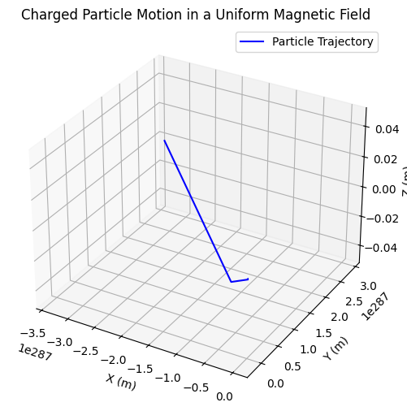
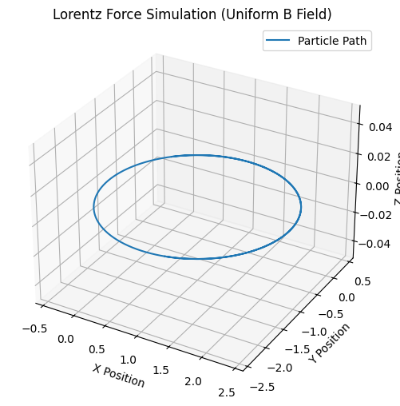

# Simulating the Effects of the Lorentz Force

## **Introduction**
The Lorentz force is a fundamental concept in electromagnetism, describing how charged particles move in electric and magnetic fields. It plays a crucial role in many physical systems, from the operation of mass spectrometers to the confinement of plasma in nuclear fusion reactors. By simulating the effects of the Lorentz force, we can visualize and better understand how charged particles behave under different field configurations.

This article explores the practical significance of the Lorentz force, discusses real-world applications, and outlines a simulation approach using Python to model particle motion in various field scenarios.

## **Understanding the Lorentz Force**
The Lorentz force equation is given by:

$$
\mathbf{F} = q(\mathbf{E} + \mathbf{v} \times \mathbf{B})
$$

where:
- $q$ is the charge of the particle,
- $\mathbf{E}$ is the electric field,
- $\mathbf{B}$ is the magnetic field,
- $\mathbf{v}$ is the velocity of the particle,
- $\times$ represents the cross-product.

This force affects charged particles differently depending on the presence and configuration of electric and magnetic fields.

## **Real-World Applications of the Lorentz Force**
### **1. Particle Accelerators**
In synchrotrons and cyclotrons, magnetic fields guide charged particles along curved paths, while electric fields accelerate them. These accelerators are used in scientific research, medical treatments (e.g., proton therapy for cancer), and industry.

### **2. Mass Spectrometry**
A mass spectrometer uses electric and magnetic fields to determine the mass-to-charge ratio of ions. By measuring how particles deflect under these forces, scientists can identify chemical compounds.

### **3. Plasma Confinement in Fusion Reactors**
Magnetic fields are crucial in confining plasma in devices like tokamaks and stellarators, preventing charged particles from escaping and enabling nuclear fusion reactions.

### **4. Earth's Magnetosphere**
The Earth's magnetic field interacts with solar wind (charged particles from the Sun), shaping the magnetosphere and causing phenomena such as the Northern and Southern Lights (aurora borealis and aurora australis).

## **Simulating the Lorentz Force**
To visualize the effects of the Lorentz force, we will simulate the trajectory of a charged particle under different field conditions using Python. 

### **1. Motion in a Uniform Magnetic Field**
A charged particle moving perpendicular to a uniform magnetic field undergoes circular motion due to the Lorentz force acting as a centripetal force.

The radius of the circular path (Larmor radius) is given by:

$$
r_L = \frac{m v}{|q| B}
$$

where:
- $m$ is the mass of the particle,
- $v$ is the velocity perpendicular to the magnetic field,
- $B$ is the magnetic field strength.

The angular frequency (cyclotron frequency) is:

$$
\omega_c = \frac{|q| B}{m}
$$

### **2. Motion in Combined Electric and Magnetic Fields**
When both electric and magnetic fields are present, a particle's trajectory depends on their relative orientation:
- **Parallel fields ($\mathbf{E} \parallel \mathbf{B}$)**: The particle accelerates linearly along the field direction.
- **Perpendicular fields ($\mathbf{E} \perp \mathbf{B}$)**: The particle undergoes a drift motion, moving in a helical trajectory.

### **3. Drift Motion in Crossed Fields**
When an electric field is perpendicular to a magnetic field, the particle experiences a **drift velocity** given by:

$$
\mathbf{v_d} = \frac{\mathbf{E} \times \mathbf{B}}{B^2}
$$

This principle is used in devices like the Hall effect sensor and certain plasma containment strategies.

---

## **Python Simulation**
The following Python code simulates the motion of a charged particle in a uniform magnetic field using the **Euler method** for numerical integration.

```python
import numpy as np
import matplotlib.pyplot as plt
from mpl_toolkits.mplot3d import Axes3D

# Constants
q = 1.6e-19   # Charge of the particle (Coulombs)
m = 9.11e-31  # Mass of the particle (kg)
B = np.array([0, 0, 1])  # Magnetic field (Tesla) along z-axis
E = np.array([0, 0, 0])  # Electric field (V/m)

# Initial conditions
v0 = np.array([1e5, 0, 0])  # Initial velocity (m/s)
r0 = np.array([0, 0, 0])    # Initial position (m)
dt = 1e-10  # Time step (s)
num_steps = 1000  # Number of iterations

# Lists to store position data
x, y, z = [], [], []

# Initializing velocity and position
v = v0
r = r0

# Euler method for numerical integration
for _ in range(num_steps):
    F = q * (E + np.cross(v, B))  # Compute Lorentz force
    a = F / m  # Compute acceleration
    v = v + a * dt  # Update velocity
    r = r + v * dt  # Update position
    
    x.append(r[0])
    y.append(r[1])
    z.append(r[2])

# Plot the trajectory in 3D
fig = plt.figure(figsize=(8, 6))
ax = fig.add_subplot(111, projection='3d')
ax.plot(x, y, z, label='Particle Trajectory', color='b')
ax.set_xlabel('X (m)')
ax.set_ylabel('Y (m)')
ax.set_zlabel('Z (m)')
ax.set_title('Charged Particle Motion in a Uniform Magnetic Field')
plt.legend()
plt.show()
```


### **Interpreting the Results**
- If the initial velocity is perpendicular to the magnetic field, the particle follows a **circular path**.
- If the velocity has a component along the magnetic field, the particle follows a **helical path**.
- If an electric field is introduced, it alters the trajectory based on the field directions.

---

## **Expanding the Simulation**
To explore more complex cases, we can extend the simulation to:
1. **Include an electric field** to observe drift motion.
2. **Use a Runge-Kutta method** for more accurate integration.
3. **Simulate non-uniform magnetic fields** found in real-world systems.

Another Example:

```python
import numpy as np
import matplotlib.pyplot as plt
from mpl_toolkits.mplot3d import Axes3D

# Constants
q = 1.0       # Charge of particle (arbitrary units)
m = 1.0       # Mass of particle (arbitrary units)
B = np.array([0, 0, 1])  # Magnetic field (along z-axis)
E = np.array([0, 0, 0])  # Electric field (set to zero initially)
dt = 0.01     # Time step
t_max = 10    # Simulation time

# Initial conditions: position (x, y, z) and velocity (vx, vy, vz)
state = np.array([0, 0, 0, 1, 1, 0])  # Starts at origin with velocity (1,1,0)

# Lorentz force equation: dv/dt = (q/m) * (E + v x B)
def lorentz_force(state, q, m, E, B):
    r = state[:3]  # Position (x, y, z)
    v = state[3:]  # Velocity (vx, vy, vz)
    dvdt = (q / m) * (E + np.cross(v, B))  # Compute acceleration
    return np.hstack((v, dvdt))  # Return derivative of state

# Runge-Kutta 4th Order Integration
def rk4_step(state, dt, q, m, E, B):
    k1 = lorentz_force(state, q, m, E, B) * dt
    k2 = lorentz_force(state + k1 / 2, q, m, E, B) * dt
    k3 = lorentz_force(state + k2 / 2, q, m, E, B) * dt
    k4 = lorentz_force(state + k3, q, m, E, B) * dt
    return state + (k1 + 2 * k2 + 2 * k3 + k4) / 6  # RK4 formula

# Simulate motion
time = np.arange(0, t_max, dt)
trajectory = np.zeros((len(time), 3))

for i, t in enumerate(time):
    trajectory[i] = state[:3]  # Store position
    state = rk4_step(state, dt, q, m, E, B)  # Update state

# Plot results
fig = plt.figure(figsize=(8, 6))
ax = fig.add_subplot(111, projection='3d')
ax.plot(trajectory[:, 0], trajectory[:, 1], trajectory[:, 2], label="Particle Path")
ax.set_xlabel("X Position")
ax.set_ylabel("Y Position")
ax.set_zlabel("Z Position")
ax.set_title("Lorentz Force Simulation (Uniform B Field)")
ax.legend()
plt.show()
```

---

## **Conclusion**
The Lorentz force is a fundamental principle governing charged particle motion in electric and magnetic fields. By simulating its effects, we can gain insights into a wide range of applications, from accelerators to space physics. Through computational methods, we can visualize complex particle dynamics and explore how different parameters influence motion.

This simulation provides a hands-on approach to understanding electromagnetism, bridging the gap between theoretical concepts and real-world applications.

