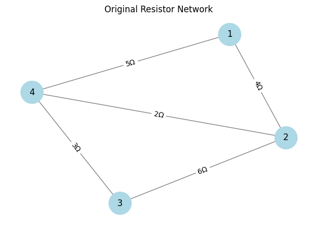
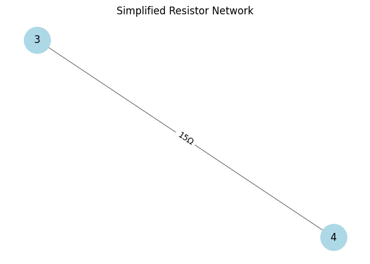

# **Equivalent Resistance Using Graph Theory**  

## **Introduction**  
Electrical circuits are fundamental to modern technology, from household wiring to complex electronic devices. A key concept in circuit analysis is **equivalent resistance**, which allows us to simplify circuits by reducing multiple resistors into a single equivalent value. While traditional methods rely on applying series and parallel rules manually, **graph theory** offers a systematic approach to solving these problems efficiently.  

By representing a circuit as a **graph**, where **nodes** correspond to electrical junctions and **edges** represent resistors, we can analyze circuits in a structured way. This method is particularly useful in circuit simulation, network optimization, and automated circuit analysis.  

In this article, we explore how graph theory can be applied to compute equivalent resistance, explain an algorithmic approach, and provide real-world applications. Finally, we implement a Python-based solution to calculate the equivalent resistance of complex circuits.  

---

## **Real-World Applications of Equivalent Resistance Calculation**  
Graph-theoretic approaches to resistance calculations have practical significance in several fields:  

### **1. Electrical Engineering**  
- **Power Grids**: Electrical networks in power distribution require efficient resistance calculations to minimize energy loss.  
- **PCB Design**: Printed Circuit Boards (PCBs) contain intricate resistor networks, where automated analysis ensures efficient design.  

### **2. Computer Networks**  
- **Data Transmission Networks**: The flow of electrical signals in communication lines can be analyzed similarly to circuits, optimizing signal integrity.  

### **3. Biomedical Engineering**  
- **Electrocardiography (ECG) Models**: Electrical signals in biological tissues can be modeled using resistive networks to understand signal propagation in the human body.  

---

## **Graph Theory Approach to Equivalent Resistance**  

A circuit can be represented as an **undirected weighted graph**, where:  
- **Nodes (Vertices)** = Junction points  
- **Edges** = Resistors with weights equal to their resistance values  

Graph algorithms help identify and simplify **series and parallel** resistor combinations iteratively.  

### **Key Graph Operations for Circuit Analysis**  
1. **Series Reduction**: If two resistors share a single intermediate node and no other connections, they are combined as:  
   $$
   R_{\text{eq}} = R_1 + R_2
   $$  
2. **Parallel Reduction**: If multiple resistors connect the same two nodes, they are combined as:  
   $$
   \frac{1}{R_{\text{eq}}} = \frac{1}{R_1} + \frac{1}{R_2} + \dots
   $$  
3. **Complex Graphs**: Use depth-first search (DFS) or breadth-first search (BFS) to traverse the circuit and identify patterns.  

---

## **Algorithm for Equivalent Resistance Calculation**  

### **Step-by-Step Process**  
1. **Build the Graph Representation**  
   - Create a graph with **nodes** as junctions and **edges** as resistors.  
2. **Identify Series and Parallel Connections**  
   - Traverse the graph to detect series and parallel structures.  
3. **Iteratively Reduce the Graph**  
   - Apply series and parallel resistance formulas.  
   - Replace simplified connections with new equivalent resistance values.  
4. **Repeat Until a Single Resistance Remains**  
   - The final graph should contain only two nodes (source and target) with a single edge representing the **equivalent resistance**.  

---

## **Python Implementation Using NetworkX**  

Here’s a Python implementation to compute equivalent resistance using **NetworkX**, a powerful graph library.  

### **Python Code with Graph Visualization**  
```python
import networkx as nx
import matplotlib.pyplot as plt

def parallel_resistance(*resistors):
    """Calculate equivalent resistance of resistors in parallel."""
    if len(resistors) == 0:
        return float('inf')
    return 1 / sum(1 / r for r in resistors if r > 0)

def simplify_circuit(G):
    """Reduce the graph by identifying and simplifying series and parallel resistances."""
    G = G.copy()  # Work on a copy to avoid modifying the original graph

    while True:
        merged = False

        # Detect and reduce series connections (degree-2 nodes)
        for node in list(G.nodes):
            neighbors = list(G.neighbors(node))
            if len(neighbors) == 2:
                n1, n2 = neighbors
                if G.has_edge(n1, node) and G.has_edge(node, n2):
                    r1 = G[n1][node]['weight']
                    r2 = G[node][n2]['weight']
                    req = r1 + r2  # Series resistance formula

                    # Add new connection and remove intermediate node
                    G.add_edge(n1, n2, weight=req)
                    G.remove_node(node)
                    merged = True
                    break  # Restart loop after each merge to avoid conflicts

        # Detect and reduce parallel resistances
        for u, v in list(G.edges):
            parallel_edges = [d['weight'] for x, y, d in G.edges(data=True) if {x, y} == {u, v}]
            if len(parallel_edges) > 1:
                req = parallel_resistance(*parallel_edges)
                
                # Remove all existing parallel edges
                G.remove_edges_from([(u, v) for _ in parallel_edges])
                G.add_edge(u, v, weight=req)
                merged = True
                break  # Restart loop after each merge

        if not merged:
            break  # Stop when no more simplifications are possible

    return G

def draw_graph(G, title="Resistor Network"):
    """Draws the resistor network graph."""
    pos = nx.spring_layout(G, seed=42)  # Generate positions for nodes
    plt.figure(figsize=(6, 4))
    
    # Draw the graph nodes and edges
    nx.draw(G, pos, with_labels=True, node_color='lightblue', node_size=1000, font_size=12, edge_color='gray')

    # Label the edges with resistance values
    edge_labels = {(u, v): f"{d['weight']}Ω" for u, v, d in G.edges(data=True)}
    nx.draw_networkx_edge_labels(G, pos, edge_labels=edge_labels, font_size=10)

    plt.title(title)
    plt.show()

# Define circuit as a graph (Nodes = junctions, Edges = resistors)
G = nx.Graph()
G.add_edge(1, 2, weight=4)  # 4Ω resistor
G.add_edge(2, 3, weight=6)  # 6Ω resistor
G.add_edge(3, 4, weight=3)  # 3Ω resistor
G.add_edge(1, 4, weight=5)  # 5Ω resistor
G.add_edge(2, 4, weight=2)  # 2Ω resistor (parallel with 5Ω)

# Draw original circuit
draw_graph(G, title="Original Resistor Network")

# Simplify the circuit
G_simplified = simplify_circuit(G)

# Draw simplified circuit
draw_graph(G_simplified, title="Simplified Resistor Network")

# Compute equivalent resistance between nodes 1 and 4 (if exists)
if G_simplified.has_edge(1, 4):
    print(f"Equivalent Resistance: {G_simplified[1][4]['weight']} Ω")
else:
    print("No direct path found after reduction.")
```



---

## **Conclusion**  
Applying **graph theory** to equivalent resistance problems provides a structured and algorithmic approach to circuit analysis. This method:  
✅ **Handles complex circuits** more effectively than manual calculations.  
✅ **Enables automation** in electrical simulations.  
✅ **Bridges electrical engineering and graph theory**, showing the power of interdisciplinary problem-solving.  

By leveraging **NetworkX** and **graph algorithms**, we can efficiently simplify resistor networks, making circuit analysis more scalable and computationally effective.  