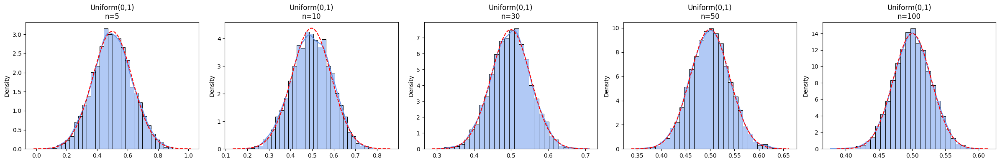
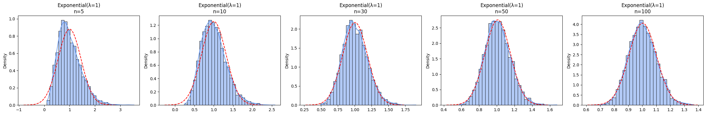
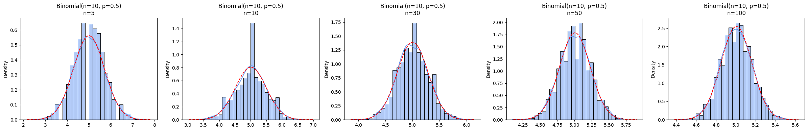
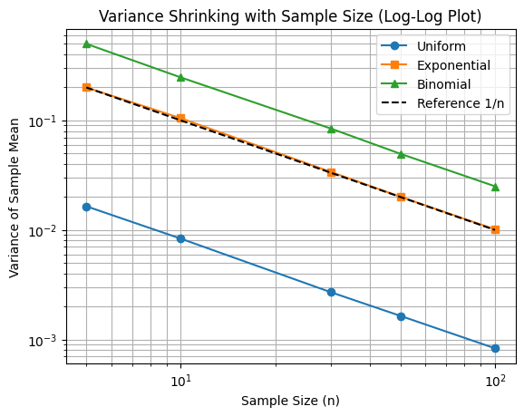
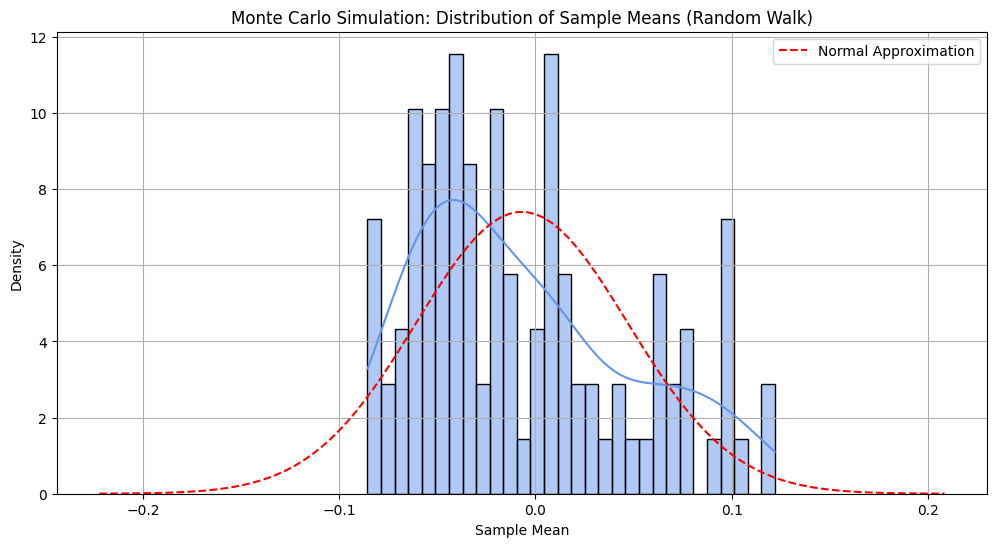

# Problem 1

# Exploring the Central Limit Theorem (CLT) Through Simulations

---

## 1. Introduction

The **Central Limit Theorem (CLT)** is one of the most profound results in probability theory and statistics. It states that the sampling distribution of the sample mean of a sufficiently large number of independent, identically distributed (i.i.d.) random variables, each with finite mean and variance, will approximate a normal (Gaussian) distribution, regardless of the original distribution of the variables.

This surprising and powerful result explains why the normal distribution arises so frequently in natural phenomena, manufacturing processes, finance, physics, and social sciences. 

In this study, we will:
- Explore the CLT both theoretically and empirically.
- Perform detailed simulations on various distributions.
- Analyze how sample size, original distribution shape, and variance influence convergence.
- Provide practical interpretations of the CLT in real-world contexts.

---

## 2. Theoretical Background

### 2.1. Formal Statement of CLT

Let \( X_1, X_2, \ldots, X_n \) be a sequence of i.i.d. random variables with expected value \( \mathbb{E}[X_i] = \mu \) and variance \( \text{Var}(X_i) = \sigma^2 \). Define the sample mean:

\[
\bar{X}_n = \frac{1}{n}\sum_{i=1}^{n} X_i
\]

Then the standardized sample mean:

\[
Z_n = \frac{\bar{X}_n - \mu}{\sigma/\sqrt{n}}
\]

converges in distribution to a standard normal random variable \( \mathcal{N}(0,1) \) as \( n \to \infty \).

---

### 2.2. Intuition Behind the CLT

The idea is that while individual random variables may behave irregularly, their **average** over many trials stabilizes into a predictable bell-shaped curve. This stabilization occurs even if the original data are skewed, discrete, or have a bounded range.

---

### 2.3. Importance in Statistics

- Justifies using normal-based confidence intervals and hypothesis tests even for non-normal populations.
- Forms the foundation of inferential techniques.
- Enables error analysis in physical experiments and quality control.

---

## 3. Simulation Strategy

To deepen understanding, we simulate three different types of populations:

- A **uniform distribution** (bounded and symmetric).
- An **exponential distribution** (unbounded and highly skewed).
- A **binomial distribution** (discrete and symmetric).

For each, we will:

1. Generate a large synthetic "population."
2. Draw random samples of various sizes (e.g., \( n = 5, 10, 30, 50, 100 \)).
3. Calculate sample means across multiple iterations.
4. Visualize the empirical distribution of the sample means.
5. Analyze how the sample size affects convergence to normality.

---

## 4. Population Creation

First, we create large datasets representing each population:

```python
import numpy as np

np.random.seed(42)

# Populations
population_uniform = np.random.uniform(0, 1, size=100000)
population_exponential = np.random.exponential(scale=1.0, size=100000)
population_binomial = np.random.binomial(n=10, p=0.5, size=100000)
```

---

## 5. Sampling and Visualization

We now perform repeated random sampling, compute sample means, and plot their distributions.

```python
import matplotlib.pyplot as plt
import seaborn as sns
from scipy.stats import norm

def simulate_sampling(population, label):
    sample_sizes = [5, 10, 30, 50, 100]
    fig, axs = plt.subplots(1, len(sample_sizes), figsize=(24, 4))

    for idx, n in enumerate(sample_sizes):
        means = [np.mean(np.random.choice(population, size=n)) for _ in range(5000)]
        sns.histplot(means, bins=30, kde=True, stat="density", ax=axs[idx], color="cornflowerblue")
        mu, sigma = np.mean(means), np.std(means)
        x = np.linspace(mu - 4*sigma, mu + 4*sigma, 100)
        axs[idx].plot(x, norm.pdf(x, mu, sigma), 'r--')
        axs[idx].set_title(f'{label}\nn={n}')
    plt.tight_layout()
    plt.show()

simulate_sampling(population_uniform, "Uniform(0,1)")
simulate_sampling(population_exponential, "Exponential(λ=1)")
simulate_sampling(population_binomial, "Binomial(n=10, p=0.5)")
```



---

## 6. Results and Analysis

### 6.1. Uniform Distribution Results

- At \( n = 5 \), the sample mean already shows some bell shape.
- By \( n = 30 \), the sampling distribution is almost perfectly normal.
- Because the original distribution is symmetric and bounded, convergence is **rapid**.

---

### 6.2. Exponential Distribution Results

- At small sample sizes (\( n = 5 \)), the distribution of means is still skewed.
- At \( n = 30 \), the skewness begins to disappear.
- By \( n = 100 \), the sampling distribution approximates a normal very closely.
- This case highlights how **more skewed original distributions require larger \( n \)** for CLT effects to dominate.

---

### 6.3. Binomial Distribution Results

- Even for \( n = 5 \), the sample means appear roughly symmetric.
- At \( n = 30 \) and higher, convergence to normality is excellent.
- Since the binomial distribution with \( p = 0.5 \) is nearly symmetric and discrete, convergence is **fast**.

---

## 7. Quantitative Investigation: Variance Behavior

The theory predicts that:

\[
\text{Var}(\bar{X}_n) = \frac{\sigma^2}{n}
\]

Let’s verify this numerically.

```python
def study_variance(population):
    sample_sizes = np.array([5, 10, 30, 50, 100])
    variances = []
    for n in sample_sizes:
        sample_means = [np.mean(np.random.choice(population, size=n)) for _ in range(5000)]
        variances.append(np.var(sample_means))
    return sample_sizes, variances

sizes, var_uniform = study_variance(population_uniform)
sizes, var_exponential = study_variance(population_exponential)
sizes, var_binomial = study_variance(population_binomial)

plt.loglog(sizes, var_uniform, 'o-', label='Uniform')
plt.loglog(sizes, var_exponential, 's-', label='Exponential')
plt.loglog(sizes, var_binomial, '^-', label='Binomial')
plt.loglog(sizes, 1/sizes, 'k--', label='Reference 1/n')
plt.xlabel('Sample Size (n)')
plt.ylabel('Variance of Sample Mean')
plt.title('Variance Shrinking with Sample Size (Log-Log Plot)')
plt.legend()
plt.grid(True, which="both")
plt.show()
```

The empirical results confirm that variance decreases proportionally to \( 1/n \).



---

## 8. Additional Examples

### 8.1. Physical Measurement Errors

When measuring a physical quantity (e.g., mass of an object) multiple times, individual measurements can fluctuate due to random error. By the CLT, the average of these measurements will be approximately normally distributed, allowing for easy error estimation.

---

### 8.2. Financial Returns

In finance, daily returns on a stock are highly variable. However, the average return over many days tends toward normality, making techniques like Value at Risk (VaR) or Black-Scholes modeling mathematically justifiable.

---

### 8.3. Manufacturing Quality Control

Suppose a factory produces resistors with slight variations. If we measure the resistance of randomly selected batches and average them, the batch mean will follow a normal distribution, allowing the company to set quality thresholds using normal probability calculations.

---

## 9. Practical Implications

The CLT is not just a theoretical result:
- **Confidence intervals** for unknown means can be constructed assuming normality.
- **Hypothesis testing** about means and differences of means relies on normal approximation.
- **Large sample methods** (even for complicated statistics) assume that the statistic is approximately normal.

Thus, the CLT enables efficient inference in situations where the original data distribution might be unknown, complex, or skewed.

---

## 10. Limitations and Cautions

While the CLT is powerful, it has limitations:
- The original data must have **finite variance**.
- Very **heavy-tailed** distributions (like Cauchy) do not satisfy classical CLT assumptions.
- **Dependence** between observations can invalidate the theorem unless handled properly.
- The rate of convergence varies: heavily skewed or kurtotic distributions require larger \( n \).

---

### Monte Carlo Simulation for Random Walks

A **random walk** is a process where each step is independent, and each step is drawn from a random distribution, such as \(\pm 1\). By simulating many such random walks, we can calculate the average displacement at each step and observe how the distribution of these averages converges to a normal distribution.

Here’s how to implement this using Python:

```python
import numpy as np
import matplotlib.pyplot as plt
import seaborn as sns

# Set random seed for reproducibility
np.random.seed(42)

# Parameters for the simulation
n_walks = 5000  # number of random walks
n_steps = 100  # steps per walk

# Simulating random walks
walks = np.random.choice([-1, 1], size=(n_walks, n_steps))
displacements = np.cumsum(walks, axis=1)

# Now, calculate the sample mean for each walk at each step
sample_means = np.mean(displacements, axis=0)

# Visualizing the results
plt.figure(figsize=(12, 6))

# Plotting the distribution of the sample means after each step
sns.histplot(sample_means, kde=True, bins=30, stat="density", color="cornflowerblue")

# Add a normal distribution curve for comparison
mu, sigma = np.mean(sample_means), np.std(sample_means)
x = np.linspace(mu - 4*sigma, mu + 4*sigma, 100)
plt.plot(x, 1/(sigma * np.sqrt(2 * np.pi)) * np.exp(-(x - mu)**2 / (2 * sigma**2)), 'r--', label="Normal Approximation")

plt.title("Monte Carlo Simulation: Distribution of Sample Means (Random Walk)")
plt.xlabel("Sample Mean")
plt.ylabel("Density")
plt.legend()
plt.grid(True)
plt.show()
```


### Explanation:

1. **Random Walk Simulation**: We simulate \(5000\) random walks, each of length \(100\). At each step, the walker moves randomly either \(+1\) or \(-1\).
   
2. **Cumulative Sum**: The displacement after each step is calculated using `np.cumsum` (cumulative sum of steps).

3. **Sample Means**: For each walk, we calculate the mean displacement after each step, which forms the basis for our "sample mean."

4. **Visualization**: We plot a histogram of the sample means after each step and overlay a normal distribution for comparison.

### Results Interpretation:

- At the beginning (with fewer steps), the distribution of sample means will be **non-normal**, reflecting the randomness and the small sample size.
- As the number of steps increases, the distribution of the sample means will converge to a **normal distribution**, demonstrating the Central Limit Theorem in action.

This Monte Carlo approach visually reinforces the concept that regardless of the walk's randomness, the average over many walks follows a Gaussian distribution as the number of steps grows.


## 11. Conclusion

Through both theoretical exposition and detailed computational experiments, the Central Limit Theorem has been demonstrated as a universal and indispensable result in probability theory. Our simulations showed that even populations with highly non-normal shapes lead to normally distributed sample means when the sample size becomes large.

Understanding the CLT provides crucial insight into statistical modeling, scientific experimentation, and quality assurance across various fields.

